

# 🔤 Q-Sci

Q-Sci was collectively designed during **["Fare, sapere, diventare"](https://lascuolaopensource.xyz/it/attivita/xyz-sapere-fare-diventare)** XYZ workshop by **[La Scuola Open Source](https://lascuolaopensource.xyz)** in Loro Piceno (Macerata, Italy), from May 3–9, 2026, and released under the **SIL Open Font License 1.1** in 2026.

Q-Sci is an **experimental display typeface** and a living project, designed to evolve and expand with new glyphs over time. 

Letterforms and icons were designed using **[Chirone](https://github.com/sssuperio/chirone)**, a tool forked from [GTL](https://github.com/bbtgnn/GTL-web) and developed during the workshop. 

> *Chirone is still a wip, but it works great! <3*

| Team X 🥹🖤| Physical "I" |
|:---|:---|
| 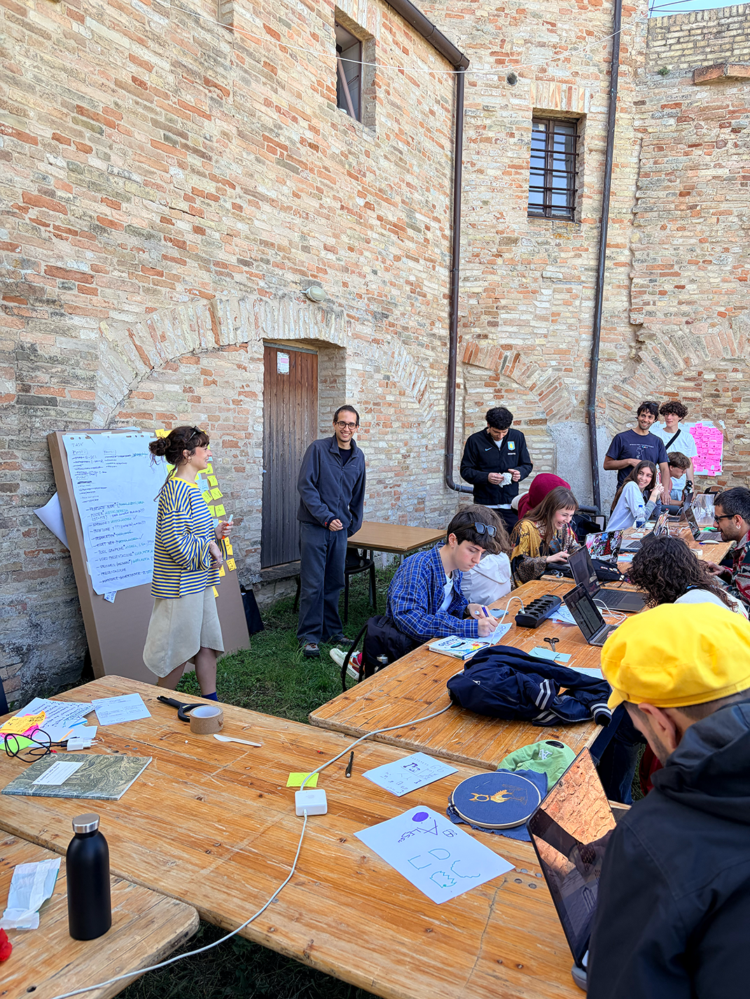 | 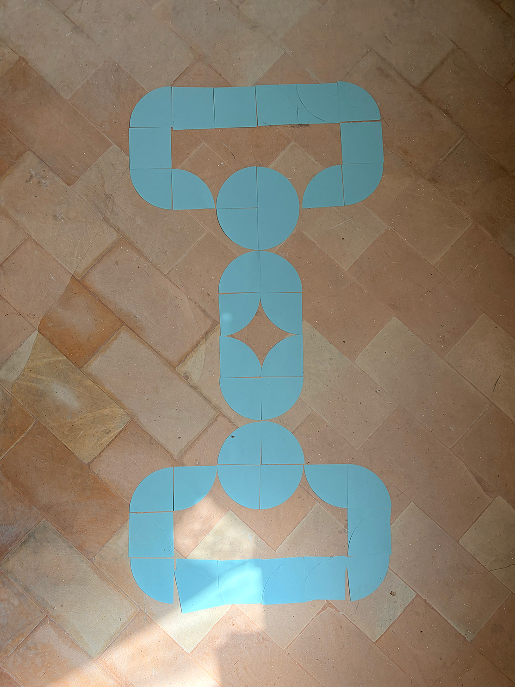 |

## 🖼️ Specimen

*click to open the PDF*

| PDF specimen |
|:---:|
|  |

| GABRIELE BINDING THE SPECIMEN |
|:---:|
|  |

| Q-SCI SPECIMEN COVER |
|:---:|
| 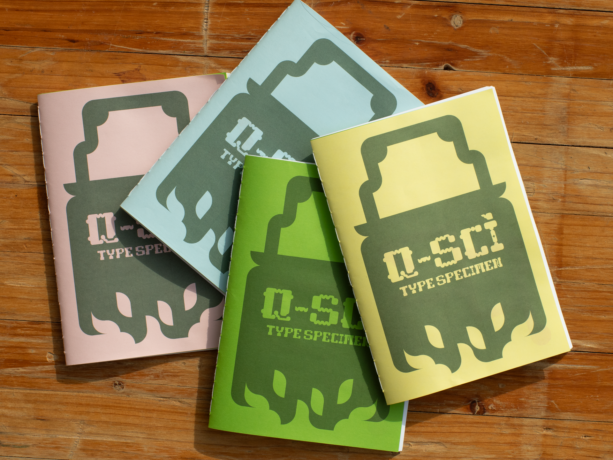 |

| LI VIZI SE PAGA |
|:---:|
| 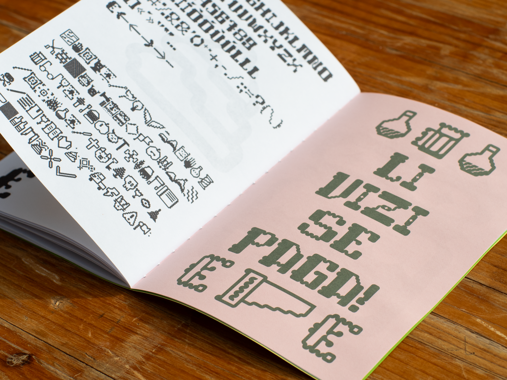 |

| DETTO IN DIALETTO LORESE |
|:---:|
| 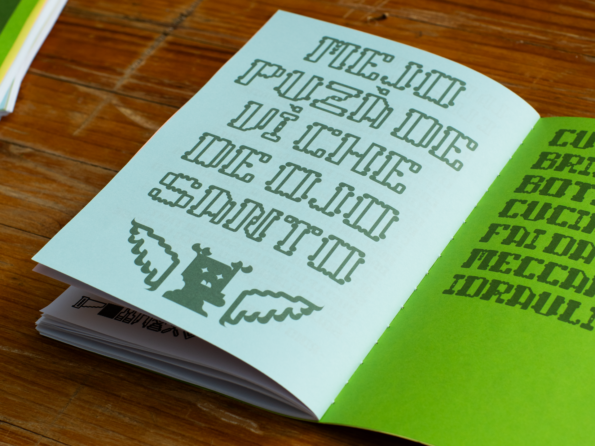 |

| L + WING |
|:---:|
| 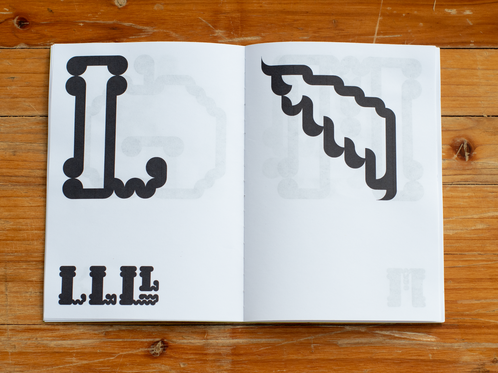 |

## 📒 Q-Sci in use

| 3D PRINTED HOWL FOR SWITCH'S COVER |
|:---:|
| 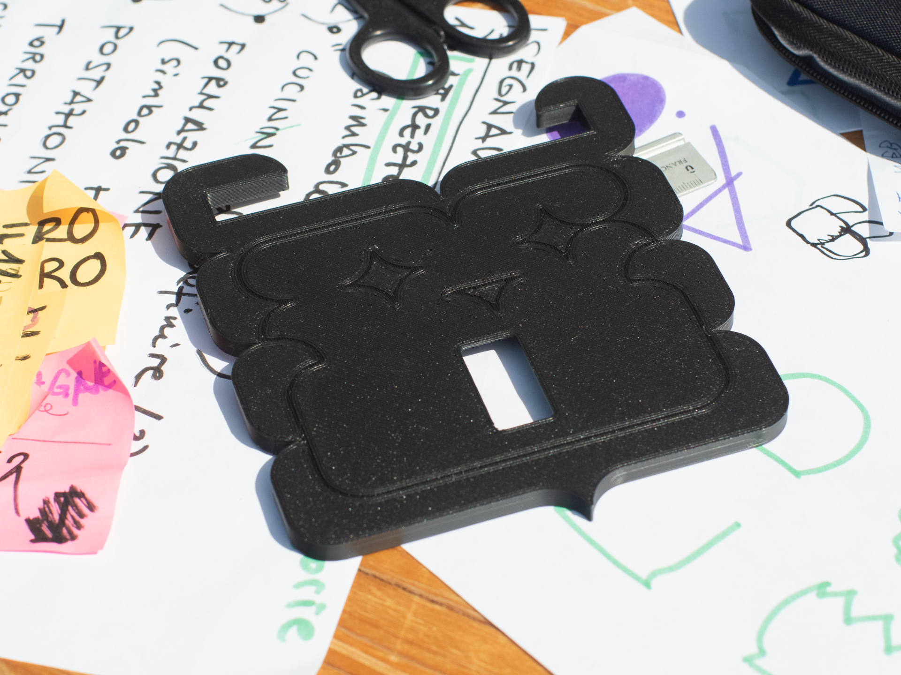 |

| Federico and Matteo| Some posters|
|:---:|:---:|
| 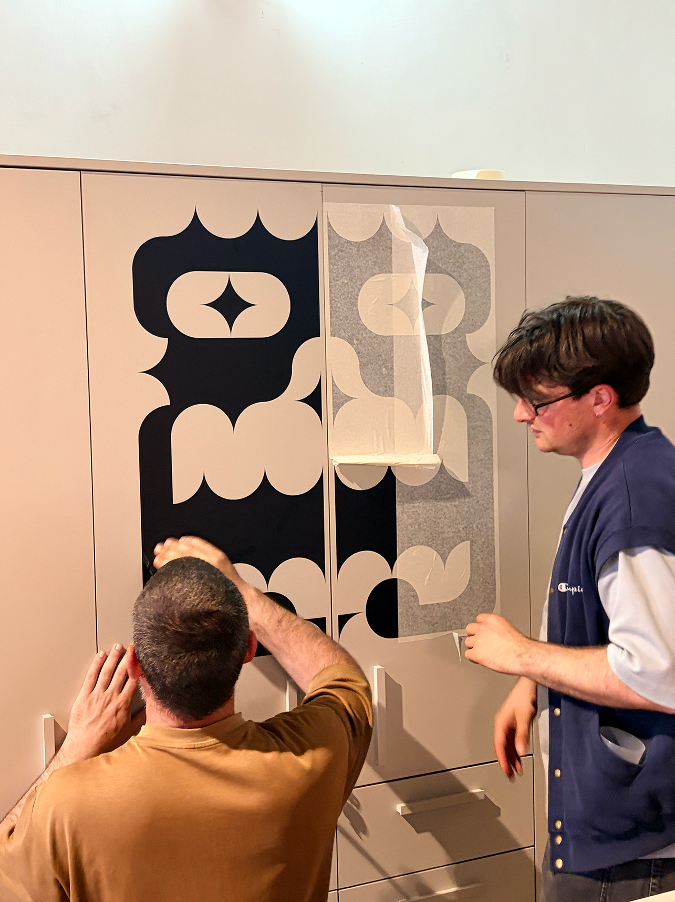 | 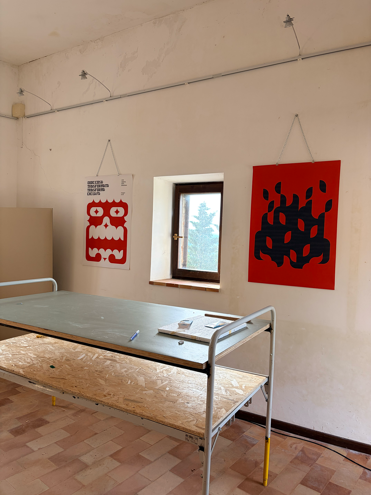 |
| POSTERS| +++ |
| 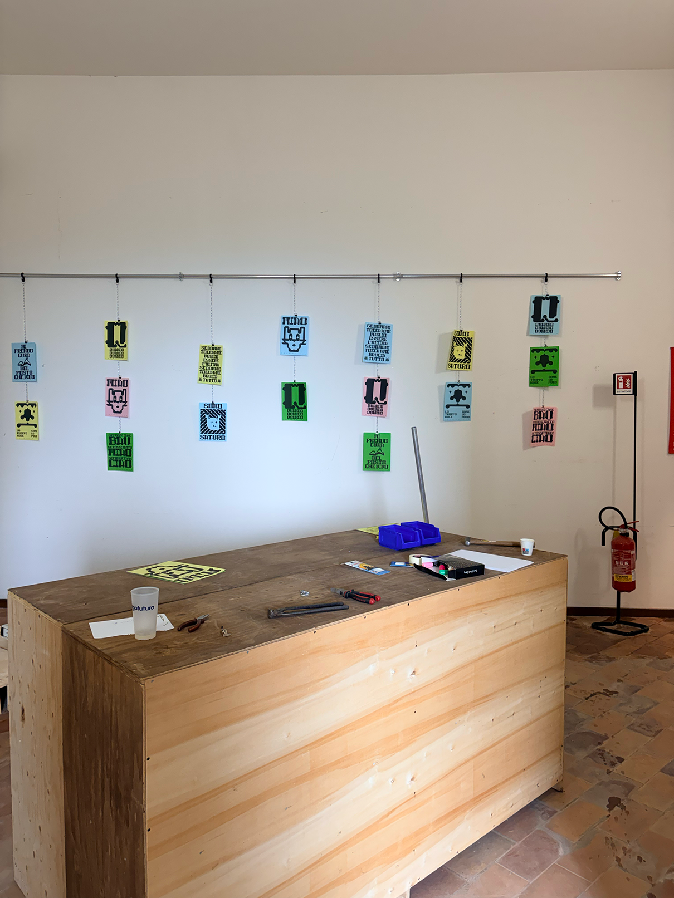 | 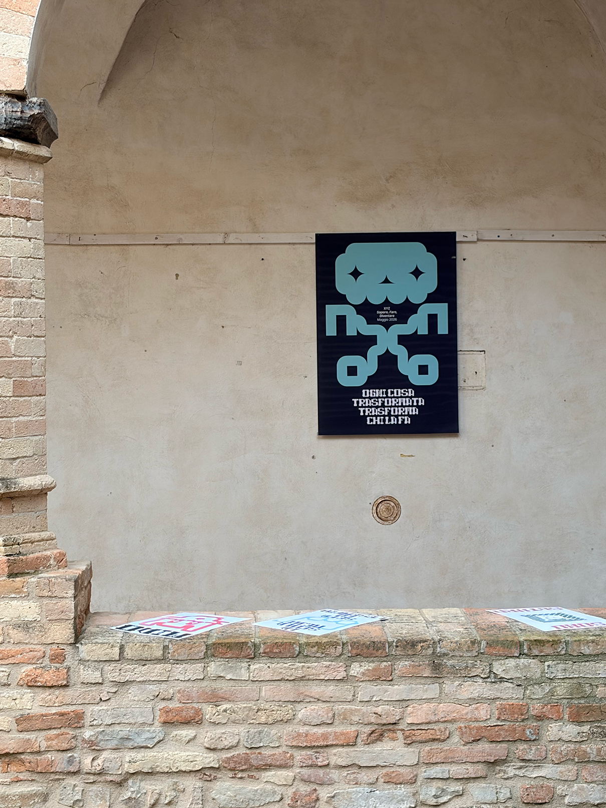 |
| +++ | +++ |
| 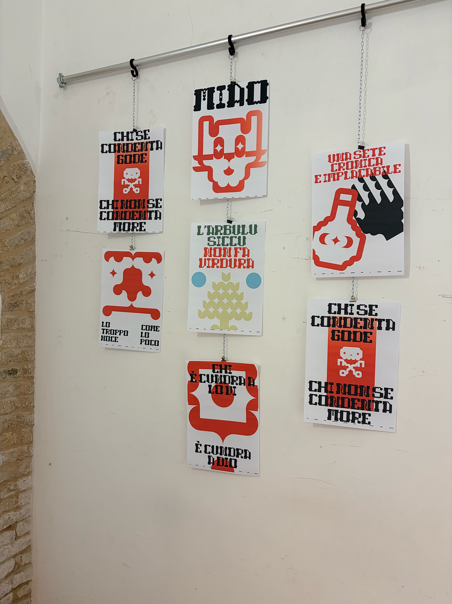 | |

## 👀 Beta Font – Handle with Care

This typeface is a work in progress!  
Some letters might still look a bit odd, and the spacing or kerning might not be perfect. Feel free to try it, break it, and share your feedback.

## 📜 License

Q-Sci is licensed under the **SIL Open Font License, Version 1.1**.
Available with a FAQ at http://scripts.sil.org/OFL

## 📂 Repository Layout

This font repository follows the Unified Font Repository v2.0,
a standard way to organize font project source files. Learn more at
https://github.com/unified-font-repository/Unified-Font-Repository
